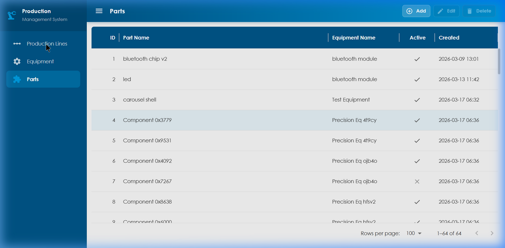

# Production Management System

[](https://opensource.org/licenses/MIT)

A modern full-stack application for managing production lines, equipment, and parts. Built with a React + Vite frontend and a secure .NET backend.

## 📖 Description

This application allows users to create, read, update, and delete (CRUD) entities within a manufacturing environment. It uses a robust relational database structure to establish links between Production Lines, Equipment, and individual Parts. Featuring a sleek, responsive UI powered by Material-UI (MUI).

---

## 📸 Screenshots & Demo

### Application Demo


### Interface Previews



---

## ⚡ Features

*   **Production Lines**: Group and manage manufacturing workflows.
*   **Equipment**: Track machinery tied to specific production lines.
*   **Parts Tracking**: Manage individual components and associate them with specific equipment.
*   **Cascade Deletion**: Safely manage relational data (e.g., deleting a Production Line warns that associated equipment and parts will also be removed).
*   **Live Validations**: Frontend form validations via `react-hook-form` and `yup`.
*   **Responsive UI**: Modern data grids with sorting, pagination, and a persistent split-panel entry form.

---

## 🛠️ Tech Stack

**Frontend**
*   [React 18](https://reactjs.org/)
*   [Vite](https://vitejs.dev/)
*   [Material-UI (MUI) v5](https://mui.com/)
*   [Axios](https://axios-http.com/)
*   React Hook Form + Yup

**Backend**
*   [.NET](https://dotnet.microsoft.com/) 
*   C# ASP.NET Core API
*   Entity Framework Core
*   SQLite/SQL Server Data Store

---

## 📂 Folder Structure

```text
crud_app/
│
├── src/
│   ├── ProductionApp/           # .NET Backend
│   └── productionReactApp/      # React Frontend
│
├── assets/                      # Demo recordings and screenshots
├── docs/                        # Project documentation files
│
├── run.bat                      # Convenience script to start both apps
├── CRUDapp.sln                  # Main .NET Solution file
└── README.md                    # Project documentation
```

---

## 🚀 Installation & Usage

### Prerequisites
*   [Node.js](https://nodejs.org/) (v18+)
*   [.NET SDK](https://dotnet.microsoft.com/download) (v8+)

### Step 1: Clone the Repository
```bash
git clone https://github.com/Vijisdurai/crud_app.git
cd crud_app
```

### Step 2: Running the Application Locally

#### Option A: Using the provided Batch File (Windows)
Double click `run.bat` or run it from the Command Prompt. It will open two new windows running both the .NET backend and React frontend automatically.
```cmd
run.bat
```

#### Option B: Using VS Code Integrated Tasks
1. Open the repository folder in VS Code.
2. Press `Ctrl + Shift + P`
3. Search for and select: `Tasks: Run Task`
4. Choose **Run Full App** (Starts both backend and frontend).

#### Option C: Manual Startup
**Backend (.NET)**
```bash
cd src/ProductionApp
dotnet restore
dotnet run
```

**Frontend (React)**
```bash
cd src/productionReactApp
npm install
npm run dev
```

The frontend will be available at `http://localhost:5173` and the backend swagger docs at `http://localhost:5094/swagger`.

---

## 📜 License

This project is licensed under the MIT License - see the [LICENSE](LICENSE) file for details.